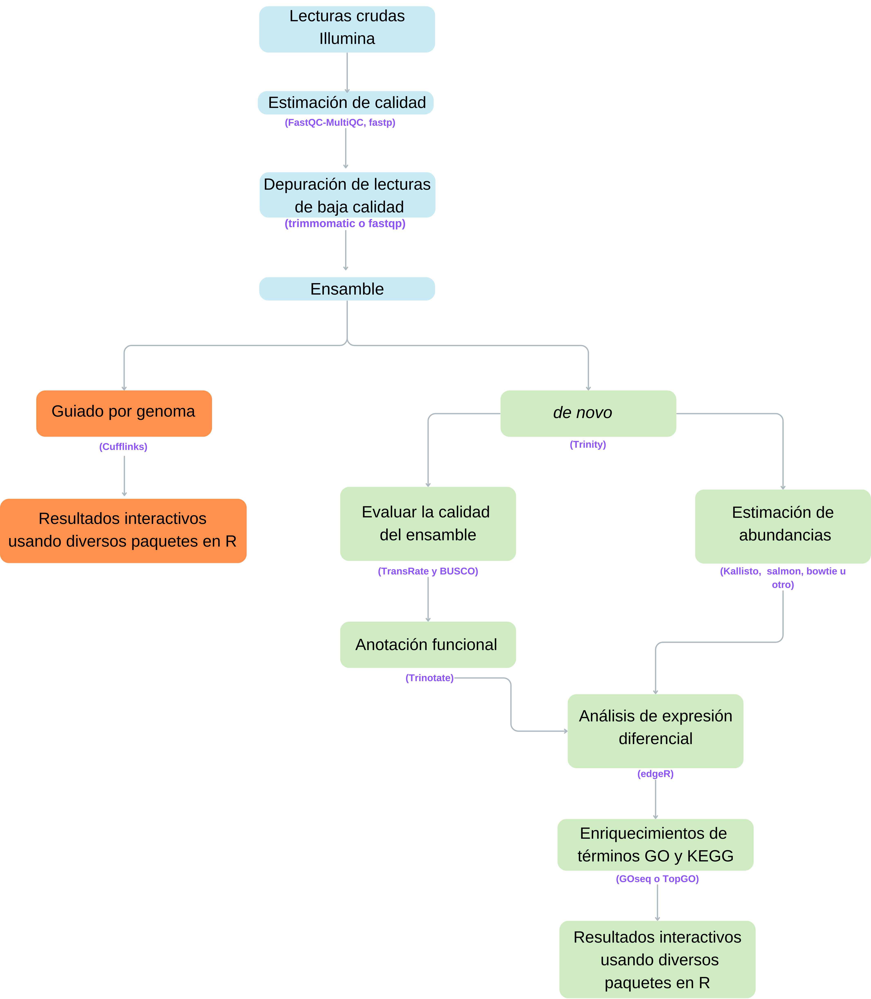

::: {#hero-heading}
:::

Resultados de análisis de lecturas de RNAseq y expresión diferencial en organismo no modelo sin genóma de referencia.

## Flujo de trabajo

{fig-align="center"}

## Muestras

| Muestra   | Descripcion   |     |
|-----------|---------------|-----|
| Ctrl  | Muestra control  |     |
| AB33 | Muestra experimental |     |
|           |               |     |

: Grupos experimentales

## Secciones:

### [Análisis Multivariado](1_MDS.qmd)

### [Contraste AB33 vs Control](2_AB33_CTL.qmd)
